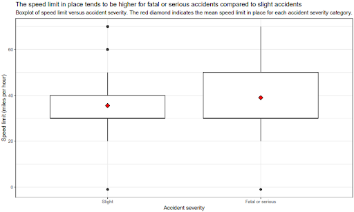
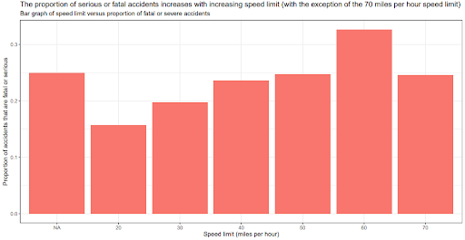

```{r setup, include=FALSE}
knitr::opts_chunk$set(echo = TRUE)
```

## Introduction

According to the World Health Organisation, there are approximately 1.3 million fatalities globally each year due to road traffic accidents @who. Indeed, road traffic injuries are the primary cause of death for those aged between five and 29 years old @who. Vulnerable road users such as pedestrians, cyclists and motorcyclists account for over half of all road traffic accident fatalities globally @who. Although most deaths occur in low- to middle-income countries, it is nevertheless an issue of significant concern for high-income countries also.  

It is well-documented that driving at an increased speed is related to both the risk of a road traffic accident and the severity of the accident, should it occur. It is reported that for every 1% increase in speed, there is a corresponding 3% increase in risk of serious crashes and 4% increase in the risk of fatal crashes. @who Other risk factors for accident severity include demographic factors; approximately three quarters (73%) of all road traffic fatalities involve males under 25 years old @who. In addition, it can be hypothesised that variables such as the time of day that the accident occurred, the condition of the road surface where the accident occurred e.g. the presence of ice which could lead to skidding or water which could result in a longer stoppage time, and the location of the accident in terms of whether it occurred close to a junction or not, could also contribute to the severity of a road traffic accident. 

An increased understanding of the impact of these factors on road accident severity could aid policymakers in decision making and be used to inform awareness campaigns aimed to promote safe driving practices. A clearer understanding of the impact of contributing factors to increased road accident severity could result in the introduction of more targeted preventative measures and a more optimal use of finite resources, aimed at increasing road safety.

The primary aim of this analysis is to determine the relationship between severity of road traffic accidents in Great Britain and the speed limit in place where the accident occurred. Secondary aims include investigating the effects of environmental, spatial and demographic factors on road accident severity. More specifically, the relationship between accident severity and road surface conditions, time of day, casualty type (e.g. pedestrian, cyclist, car occupant), junction location and involvement of males under 25 years old, will be explored as secondary aims.

Information on the data source and methods used to analyse the data will be provided in the subsequent Methods section. The Results section will present the main findings, including figures and tables. The Conclusions and Discussion section will elaborate on the findings and discuss the limitations of the analysis. 

## Methods

### Data Sources

This retrospective analysis utilised road safety data for the year 2020, which is available online from the UK’s Department of Transport @data_source. The data which is published provides details of road accidents which occurred on public roads in Great Britain, involved at least one vehicle and which resulted in human injury. Information is available on the circumstances of the accident, such as weather conditions, time of day, visibility, speed limit, road type and surface conditions. In addition, data is available on the types of vehicles and characteristics of the casualties involved. 

The outcome variable selected for this analysis was road accident severity. The available data reports accident severity as fatal, serious or slight. For this analysis, the fatal and serious groups were combined, so that accidents were sub-divided into two categories: ‘fatal or serious’ and ‘slight’. In addition, a subset of the other available variables were extracted from the data for analysis, based on their likelihood to impact accident severity. An overview of the selected variables and how they were coded for analysis is provided in the Appendix, Table 1.


### Selection of variables

There are too many variables included in the data sets to use all of them so a selection of variables were selected. These variables were selected to show a wide range of factors that could impact on accident severity. 

- Speed limit (accidents data): The relationship between speed limit and accident severity  is the main focus of the study. Speed limit can be considered as a categorical variable as there is only a set number of speed limit options. However, it is impossible to tell from the data whether a vehicle is travel ling at, above or below the speed limit. Thus, the speed limit will be considered as a continuous, quantitative variable.  Moreover, this will allow increased flexibility when predicting accident severity at different speeds.
- Road surface conditions (accidents data): This is often considered to be a key factor in accidents and it is vital to consider if this impacts on accident severity. The original data set had seven categories. However, five of these categories contained only a total of 2.4% of all accidents. It was therefore considered to be reasonable to reduce this to two variables. These were dry and wet/damp which contain 68.7% and 28.8%, respectively, of all accidents.
- Time of day (accidents data): time of day was considered important to include as it allows for the impact of the tiredness of the driver to be included in the model, as well as other associated driving issues such as drunk drivers. The original data records the actual time of each accident. This was reduced to the subcategories of night off peak (7pm-7am), morning peak (7am-10am), day off peak (10am-4pm) and evening peak (4pm-7pm). There was a fairly even split of accidents between each category: 24.9%, 14.2%, 37% and 23.9% respectively. There was no data missing for this variable.
- Casualty type (casualty data sheet):
- Age and gender of driver (vehicle data sheet):
- Proximity to a junction (vehicle data sheet):
- treatment of NAs and unknowns.

### Data analysis

- Some explanatory data analysis was conducted to see if these variables did in fact play a role in affecting accident severity. 
- Contingency tables
- Box plots were constructed to show if there are any interaction effects between the speed limit and other variables.
- GLM 

## Results

plot 1 details 



plot 2 details



## References 

